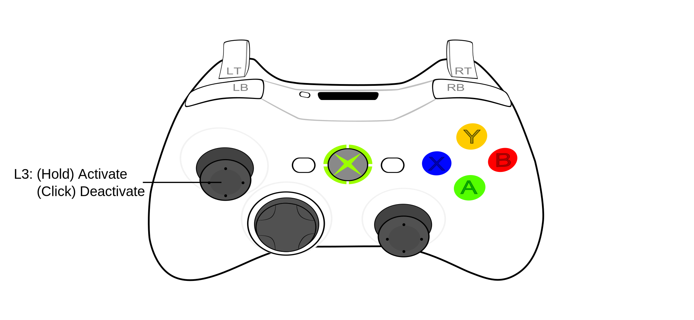
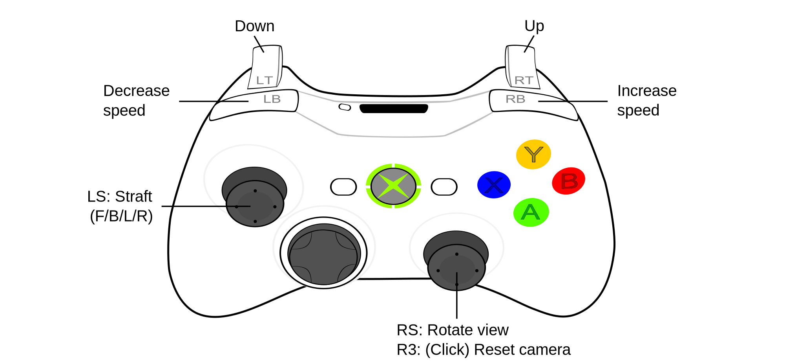
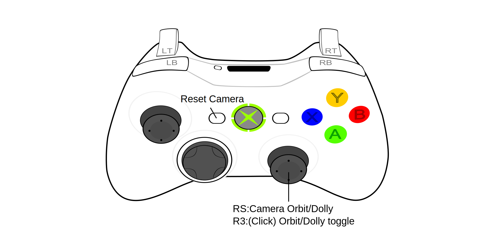
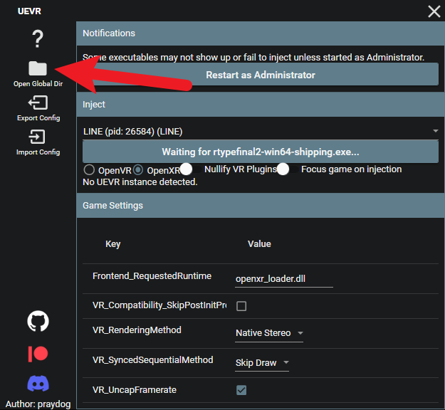
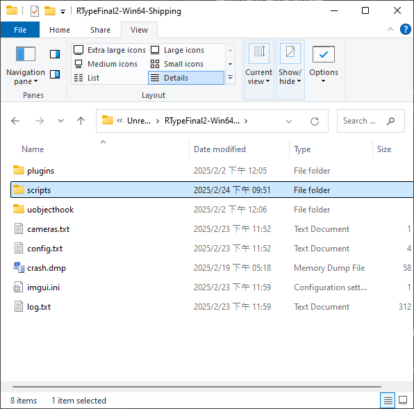
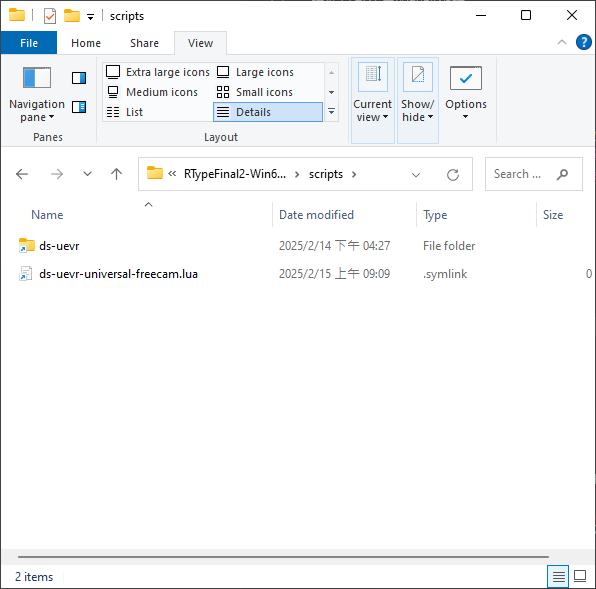

[按這打開中文說明](https://github.com/dabinn/UEVR-Universal-Free-Camera/blob/main/doc/Chinese/Readme.md)
# UEVR Universal Free Camera Plugin

The goal of this plugin is to allow users to move freely in "any" game supported by UEVR, without being restricted by the game's limitations.  
For example, whether you want to get close to a character to view their details, or fly far away to admire the scenery, this plugin can help you achieve that.

*Note: Although it’s called "any," I haven’t tested a large number of games yet. If you encounter any issues while using it, please report them to me.*

---
# Demo Video
Let’s take a look at the plugin’s effect first (click to watch the video)  
<a href="https://www.youtube.com/watch?v=A5wXk5k4WVk" target="_blank">
    
</a>

# Features
* **Free Camera**: 5-DOF control. Move in all directions with 2-axis rotation. (Toggle using controller hotkeys)
* **Ten-Speed Control**: Adapts to various types of games.
* **Customizable Hotkeys**: Prevent conflicts with game controls.
* **Two Flight Modes**: Horizontal/Omnidirectional. (Default is Horizontal Mode)
* **Two Contorl Modes**: TPS/Space (currently only TPS is supported)

# Custom Features
In addition to general functionality, this plugin can also be integrated into other plugins for custom features, enabling additional functionality for specific games.
* **Orbit Camera**: Operate simultaneously during gameplay to orbit a target object, with real-time distance adjustment (dolly).
* **Scene Camera**: Customize camera parameters or control methods based on different scenes in the game, such as changing the camera's position.  
* **Speed Setting**: Set a speed range more suitable for the game scene scale.
* **Event System**: Provides events like level switching, character switching, etc.
* **Controller Status**: Offers easier controller status detection.

(For Developers: This plugin is open-source and free to use in your own plugins.)

## Custom Game Plugins
Currently, custom game plugins integrated with Free Camera are:
* [R-Type Final 2](https://github.com/dabinn/R-Type-Final-2-UEVR)

# Default Controls
## Free Camera Hotkeys
Free Camera Mode: Hold L3 to activate / Click L3 to deactivate  


## Free Camera Controls
### TPS Mode (Default)
The control method is generally the same as controlling a game character, with the addition of `up/down` movement. This control method is simple and easy to understand, making it the most suitable for most users.


### Space Mode
Basically, this mode changes the `forward/backward` movement of the TPS mode’s left stick to `up/down` movement, while the original `forward/backward` is moved to RT/LT. This `forward/backward` control is somewhat like the controls of racing games, so it’s easy to get used to.  
It was actually derived from the recent popular 6-DOF control in space games, making three-dimensional movement more intuitive and suitable for navigating through space.
(Currently not supported in version 1.0)

## Orbit Camera Controls
The Orbit Camera (also known as the Stage Camera) is a camera mode that can be operated simultaneously during gameplay.  
It uses fewer buttons and is simpler to operate, so when the game doesn’t use the right stick, it has a chance to operate simultaneously with the game.  
However, it requires a designated center point to orbit and can only be activated in games with custom plugins.  
For example, in R-Type Final 2, the default operation for the Orbit Camera is as follows:  


# Custom Key Mapping
Open the plugin’s main script with a text editor, such as `ds-uevr-universal-freecam.lua` for the universal version of the plugin.  
You’ll see settings like this, which contain various function names:  
```lua
cfg.buttons = {
    active = "L3_held",   -- Activate free camera mode
    deactive = "L3",      -- Deactivate free camera mode
    resetCam = "R3",    -- Reset camera
    speedIncrease = "RB", -- Speed up
    speedDecrease = "LB", -- Slow down
}
```
To customize the buttons, use these button codes:  
```
A, B, X, Y 
LB, RB, LT, RT, L3, R3
DPadUp, DPadDown, DPadLeft, DPadRight
Back, Start
```
- To specify a button combination, use the `+` symbol. For example: `Select+Y`  
- To specify a special event ( `pressed, held, released, doubleclick`), use these words separated by `_` with the button name. For example: `L3_held`, `Select_pressed`  
If no event is specified, the default event for a single button is "released", which meets most needs. Button combinations do not need to specify events.  


# Installation
1. [Download the plugin](https://github.com/dabinn/UEVR-Universal-Free-Camera/releases/) and extract it  
1. Open the UEVR interface and click `Open Global Dir`  
    
1. Find your game name and locate the `scripts` directory  

1. Copy the unzipped files into the `scripts` directory  

1. That’s it!

# Known Issues / Notes
* I haven’t tested UE5 games, so I’m not sure if they work properly.
* When using UEVR's UObjectHook simultaneously to attach the camera, it may cause unexpected behavior in the Free Camera.

# To-Do
* Test compatibility with more games
* Add more button actions
* Add more customizable settings

# Special Thanks
[praydog](https://github.com/praydog)  
Author of UEVR. Besides UEVR’s powerful features, it also provides excellent plugin support, which made it possible to create the Universal Free Camera Plugin, allowing compatibility with various VR games.

[mark-mon](https://github.com/mark-mon)  
The open-source UEVR plugin code he shared is very valuable for reference, and he has been very eager to help, offering a lot of useful information on the UEVR Discord.  
