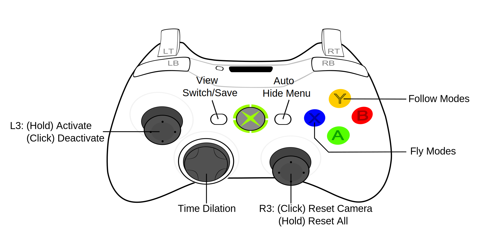

[按這打開中文說明](https://github.com/dabinn/UEVR-Universal-Free-Camera/blob/main/doc/Chinese/Readme.md)
# UEVR Universal Free Camera Plugin

The goal of this plugin is to allow users to move freely in "any" game supported by UEVR, without being restricted by the game's limitations.  
For example, whether you want to get close to a character to view their details, or fly far away to admire the scenery, this plugin can help you achieve that.

---
# Demo Video
<a href="https://www.youtube.com/watch?v=A5wXk5k4WVk" target="_blank">
    
</a>

# Features
* **Free Camera**: 5-DOF control. Move in all directions with 2-axis rotation. (Toggle using controller hotkeys)
* **Three Flight Modes**: TPS Horizontal / TPS Omnidirectional / Space Omnidirectional. (Default: TPS Horizontal)
* **Three Follow Modes**: Follow / Lock / Position-Only. (Default: Follow)
* **10-Speed Control**: Adapts to various types of games.
* **View Switching & Saving**: Switch and save views at any time.
* **Orbit Camera**: Supports custom plugins.
* **Time Dilation**: Pause / Slow Motion / Fast Motion.  **(New! v1.3.0)**
* **Customizable Hotkeys**: Prevent conflicts with game controls.
* **Customizable Options**: Adjust plugin settings as needed.
* **Advanced Installation**: Install once, works for all games. **(New! v1.3.0)**

[Click here to jump to Download and Installation guide](#download-and-installation)
<br>

---
The following are detailed explanations of each feature:
# Free Camera  
  
* **L3**: (Hold) Activate Free Camera mode / (Press) Disable Free Camera mode  
* **R3**: (Press) Reset camera / (Hold) Reset all settings  
* **X Button**: Switch between 3 flight modes  
* **Y Button**: Switch between 3 follow modes  
* **Back Button**: Switch view / Save view  
* **Start Button**: Toggle auto-hide game menu  
* **D-Pad**: Time Dilation
  
Tip: You can operate it correctly even while wearing a VR headset.
Just remember: Holding L3 activates Free Camera mode, while pressing it once returns to normal mode.

# Flight Modes (X Button)  
The **X Button** on the controller switches between three flight modes:  
- **TPS Flight Mode - Horizontal**: Press **X** to switch (Default)  
- **TPS Flight Mode - Omnidirectional**: Press **X** to switch  
- **Space Flight Mode - Omnidirectional**: Hold **X** to activate  

## TPS Horizontal / Omnidirectional Flight Mode  
The control method is generally the same as controlling a game character, with the addition of `up/down` movement.  This intuitive control scheme is easy to understand and suits most players.  
  

- **Horizontal Mode**: The easiest mode to operate, looking up or down does not affect altitude.  
  Ideal for aerial views of the ground or inspecting character details without worrying about height changes.  
    
  
- **Omnidirectional Mode**: The camera's altitude changes based on movement direction.  
  Similar to flight game controls, useful for moving the camera directly toward or away from a character.  
    

## Space Omnidirectional Flight Mode  
The **left stick** moves the camera **up, down, left, and right**, making it ideal for complex 3D space maneuvering.  
**Forward/backward movement** is reassigned to **RT/LT**.  
This mode only supports **omnidirectional flight** and does not include a horizontal flight option.  
*(Demo image here)*  
*(Control settings image here)*  

# Follow Modes (Y Button)  
The **Y Button** on the controller switches between three follow modes:  

- **Follow Mode**: Press **Y** once (Default)  
  Suitable for most games—the camera follows the character's movement and rotation.  
  *(Image here)*  

- **Lock Mode**: Hold **Y**  
  Use this mode when you want to fix the camera's position and prevent it from moving with the character.  
  This is especially useful during cutscenes, where the in-game camera frequently changes. If you want to watch from a spectator's perspective, switch to this mode.  
  *(Image here)*  

  **Note:** Since this mode fully locks the camera, it may appear as if the in-game camera controls are unresponsive. To prevent accidental activation, it requires **holding** the **Y Button** instead of a single press like the flight modes.  

- **Position-Only Follow Mode**: Press **Y** twice  
  This mode is particularly useful in vehicle situations.  
  If you dislike the camera constantly rotating and want to keep your view steady—but fully locking the camera would cause the vehicle to move away...  
  This mode provides a solution by following the position while ignoring rotation.  
  *(Image here)*  

# View Saving & Switching (Back Button)  
By default, **two views** can be saved and switched.  
A "view" refers to your current **camera position and angle**.  
- **Hold the Back Button** to save the current view.  
- **Click the Back Button** to switch to the next saved view.  
*(Image here)*  
This is very useful when you need to quickly switch between different views.  

# Reset Camera  
- **Click R3 button** to reset the camera back to its original position.  
- If you have saved a view, the camera will return to that saved position instead.  
This feature works especially well with view saving—since you can always return to a saved view with a single press, you can explore freely with the free camera without worry.  

# Reset All Settings  
This is an **emergency reset button**.  
At any time, **hold R3** to reset **all settings**, including the camera position, saved views, and follow mode.  
If you're completely lost and have no idea what’s happening—just hold this button. It will reset everything to its initial state.  
This function is also useful for restoring the original in-game camera position before setting up new saved views.  

# Auto-Hide Game Menu (Start Button)  
Sometimes, you might need to pause the game to use the free camera, but the game menu can get in the way.  
- **Click Start Button** to automatically hide the game menu.  
- When you exit free camera mode, the game menu will reappear.  

This feature is **off by default**, meaning you need to **click Start once** while in free camera mode to activate it.  
(This prevents confusion for users who might think the game menu is broken.)

# Time Dilation (D-Pad)
Allows you to pause, slow down, or speed up the game.
- **D-Pad Up**: Pause the game
- **D-Pad Left**: Slow motion
- **D-Pad Right**: Fast motion
- **D-Pad Down**: Resume normal speed

Slow motion is especially fun when used with the free camera, and fast motion lets you quickly skip boring cutscenes. The pause function can freeze time, which is useful for games that don't support pausing or when you want to take screenshots.

Bonus: **Auto Brake for Fast Forward**. Fast forward will automatically stop at the end of a cutscene to prevent accidental deaths when entering a new stage. Since every game's cutscene system is different, this feature only works when the cutscene is successfully detected.

# Custom Key Mapping
Open the plugin’s main script with a text editor, such as `ds-uevr-universal-freecam.lua` for the universal version of the plugin.  
You’ll see settings like this, which contain various button action names :  
```lua
cfg.buttons = {
    active = "L3_held", -- Activate free camera
    deactive = "L3", -- Deactivate free camera
    resetCam = "R3", -- Reset the camera
    resetAll = "R3_held", -- Reset both the camera and the custom view
    speedIncrease = "RB", -- Increase movement speed
    speedDecrease = "LB", -- Decrease movement speed
    levelFlight = "X", -- Toggle level flight / omni-directional flight mode
    omniFlightWithSpaceControl = "X_held", -- Enable omni-directional flight mode with space control scheme
    followOn = "Y", -- Enable follow mode
    followPositionOnly = "Y_doubleclick", -- Enable follow position only mode
    followOff = "Y_held", -- Disable follow mode (Hold the camera)
    viewCycle = "Back", -- Cycle through saved views
    viewSave = "Back_held", -- Save the current view
    autoGameMenuToggle = "Start", -- Hide the game menu automatically when free camera is enabled
}
```
To customize the buttons, use these button codes:  
```
A, B, X, Y 
LB, RB, LT, RT, L3, R3
DPadUp, DPadDown, DPadLeft, DPadRight
Back, Start
```
- To specify a button combination, use the `+` symbol. For example: `Select+Y`  
- To specify a special event ( `pressed, held, released, doubleclick`), use these words separated by `_` with the button name. For example: `L3_held`, `Select_pressed`  
If no event is specified, the default event for a single button is "released", which meets most needs. Button combinations do not need to specify events.  

# Custom Plugin Settings
```lua
cfg.opt={
    uevrAttachCameraCompatible = false, -- Compatible with UEVR's attached camera feature, affecting the camera offset value in the UEVR interface.
    autoGameMenuToggle = false, -- Disable game GUI when free camera is enabled
    freecamInvertPitch = false, -- Invert the pitch of the free camera
    levelFlight = true, -- The vertical orientation of the camera does not affect the flight altitude.
    recenterVROnCameraReset = true, -- Reset the camera and recenter VR at the same time
}
```

# Orbit Camera (Custom Plugin)
The Orbit Camera is a camera mode that can be operated simultaneously while playing the game.
It requires fewer buttons and is simpler to control, making it possible to implement via a custom plugin when the game does not use the right stick.

For example, in R-Type Final 2, the default operation for the Orbit Camera works like this:


Note: This feature requires support from a custom game plugin. The general version of the plugin does not support this functionality.

# Custom Plugin (Advanced Features)
In addition to general functionality, this plugin can be integrated into other plugins for customization, enabling extra features for specific games.
* **Orbit Camera**: Operate simultaneously during gameplay to orbit a target object, orbit around target objects, with real-time distance adjustment.
* **Scene Camera**: Customize camera position, speed, and button functions based on different in-game scenes.
* **Event System**: Provides events like level switching, character switching, etc.
* **Controller State**: Offers easier detection of controller states.
  
Currently Integrated Custom Game Plugins:
* [R-Type Final 2](https://github.com/dabinn/R-Type-Final-2-UEVR)

**For Developers:**
This plugin is open-source and free to use in your own plugins.
I haven’t written developer documentation yet, but you can check out the source code of the R-Type Final 2 plugin or ask me directly.


# Download and Installation
1. [Download the plugin](https://github.com/dabinn/UEVR-Universal-Free-Camera/releases/) and extract it  
1. Open the UEVR interface and click `Open Global Dir`  
    
1. Find your game name and locate the `scripts` directory  

1. Copy the extracted files into the `scripts` directory  

1. That’s it!

# Advanced Installation
If you want to install the plugin once and use it for all games, please follow these steps:

1. Open the UEVR interface and click `Open Global Dir`
1. Create a folder named `UEVR`, then create a `scripts` folder inside it.
1. Copy the extracted files into the `scripts` directory
1. That's it!

* Note 1: This installation method requires the UEVR nightly version. The current stable version of UEVR does not support this feature.
* Note 2: The plugin is designed to prevent duplicate loading. If the plugin also exists in the game directory, the one in the game directory will take priority. This ensures compatibility with custom plugins.

# Known Issues / Notes
* Manually saved camera positions may reset after switching game levels.

# Special Thanks
[praydog](https://github.com/praydog)  
Author of UEVR. Besides UEVR’s powerful features, it also provides excellent plugin support, which made it possible to create the Universal Free Camera Plugin, allowing compatibility with various VR games.

[mark-mon](https://github.com/mark-mon)  
The UEVR plugin code he shared is very valuable for reference, and he has been very eager to help, offering a lot of useful information on the UEVR Discord.  
  
[DJ (deterministicj)](https://github.com/deterministicj)  
Helped me solve the problem of some games not running the plugin with the stable version of UEVR.  
  
ponos0393  
Tested many games and provided a lot of helpful feedback. Thanks to him, this plugin now works properly in most games.