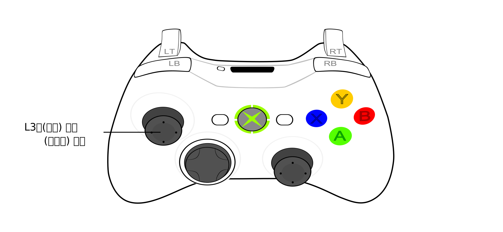
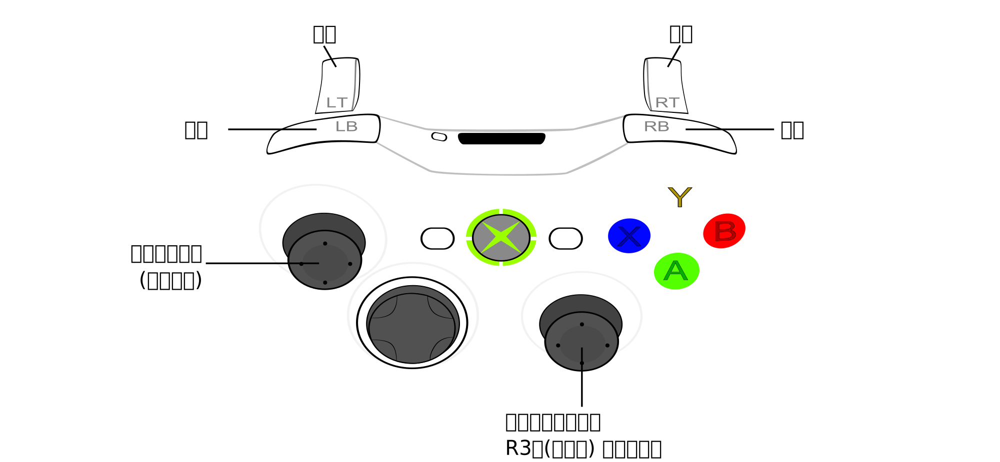
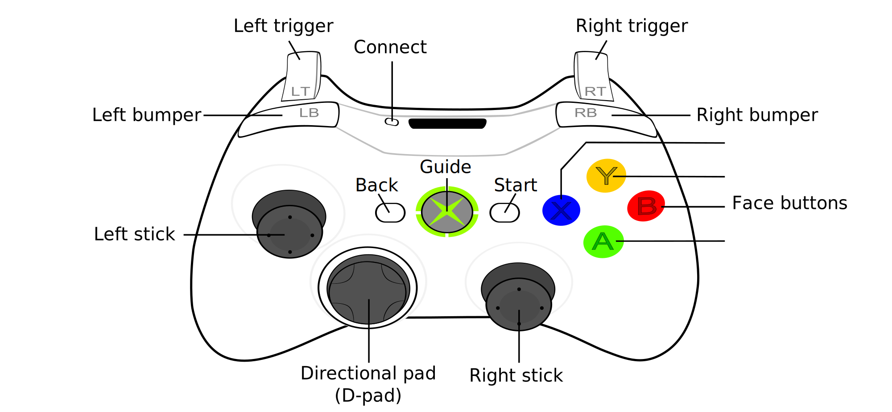
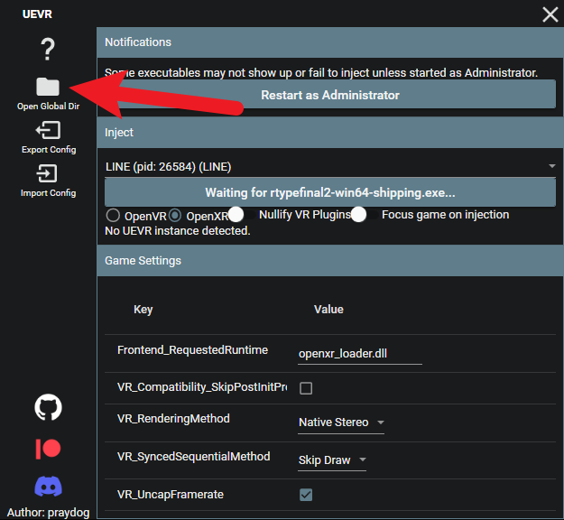
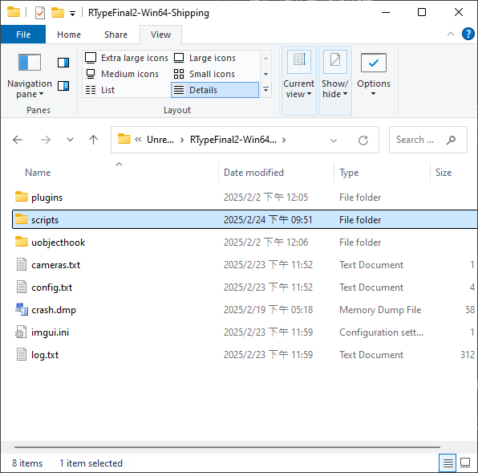
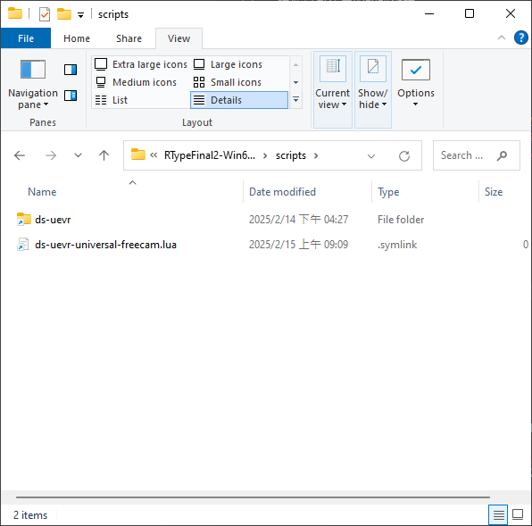

# UEVR通用自由攝影機插件

這插件的目標是讓大家在"任何"UEVR支援的遊戲中都能夠自由的移動，而不受遊戲本身的限制。
比如想貼近角色觀看他的細節，或是想要飛到遠處欣賞遊戲的風景，這插件都能幫助你達成。

*註：雖說是"任何"，但我還沒測試大量的遊戲。如果你使用上遇到什麼問題，請回報給我。

---
# 示範影片
讓我們先看看這插件的效果 (點擊開啟影片)  
<a href="https://www.youtube.com/watch?v=A5wXk5k4WVk" target="_blank">
    
</a

# 功能
* **自由攝影機**：前後左右上下移動，2軸旋轉。 (控制器熱鍵切換)
* **十段速度控制**：可適應各類型遊戲。
* **自定義熱鍵**：避免與遊戲按鍵衝突。
* **兩種飛行模式**：水平/全向。 (預設為水平模式)
* **兩種操作模式**：TPS/Space (目前僅支援TPS)

# 特製功能
除了通用功能外，本插件也可被整合到其它插件進行特製，實現各別遊戲的額外功能。
* **環繞攝影機**：遊戲進行中同時操作，環繞目標物體，並可即時拉遠拉近。
* **速度設定**：為各別遊戲設定更適合於遊戲場景尺度的速度範圍。
* **場景距離設定**：根據遊戲中不同的場景，調整最適合的攝影機推進距離。
* **事件系統**：提供關卡切換、角色切換等事件。
* **控制器狀態**：提供更容易使用的控制器狀態判斷。

(給開發者：這個插件是開源的，歡迎自由使用到你的插件中。)

## 特製遊戲插件
目前整合了Free Camera製作的特製遊戲插件有：
* [R-Type Final 2](https://github.com/dabinn/R-Type-Final-2-UEVR)

# 預設操作方式
## 自由攝影機熱鍵
自由攝影機模式：按住L3啟用/按一下L3關閉


## 自由攝影機操作
### TPS模式
移動方式大致和遊戲角色操作相容，只多了`上下`移動的操作，這種控制方式簡單易懂，最適合大部份人使用。


### Space模式
基本上就是把TPS模式左搖桿的`前後左右`移動改成了`上下左右`移動，而原本`前後`移動則改到RT/LT。這前後移動的方式有點像是賽車遊戲的操作，所以也蠻容易習慣的。其實這是由近年流行的太空遊戲六軸操作方式變化而來，對於三度空間的移動操作更加直覺，會更適合複雜的空間飛行。
(目前1.0版尚未支援)

## 環繞攝影機操作
環繞攝影機(又稱為關卡攝影機)是一種在遊戲進行中可同時操作的攝影機模式。  
他使用到的按鈕數較少，操作也較簡單，所以當遊戲未使用右搖桿時，就有機會和遊戲同時操作。
但因為他必需額外指定環繞的中心點，只能在特製遊戲才能夠打開這功能。  
例如在R-Type Final 2中，環繞攝影機的預設操作是像這樣：  


# 自定義按鍵
用文字編輯器打開插件主程式，比如通用版插件的檔名會是ds-uevr-universal-freecam.lua。  
會看到類似這樣的設定, 裏面有各項功能名稱：
```lua
cfg.buttons = {
    active = "L3_held",   -- 啟動自由攝影機模式
    deactive = "L3",      -- 離開自由攝影機模式
    resetCam = "Back",    -- 重置攝影機
    speedIncrease = "RB", -- 加速
    speedDecrease = "LB", -- 減速
}
```
要自訂義按鈕，可使用這些按鈕代號:
```
A, B, X, Y 
LB, RB, LT, RT, L3, R3
DPadUp, DPadDown, DPadLeft, DPadRight
Back, Start
```
- 若要指定按鈕組合，請使用 `+` 符號。例如：`Select+Y`
- 若要另行指定按鈕`按下、按住、放開、雙擊`等事件，請使用`pressed, held, released, doubleclick`這幾個字，並以 `_` 符號和按鈕名稱分隔。例如：`L3_held`, `Select_pressed`  
若未特別指定事件，單鍵的預設事件為 "released"，可符合大部份需求。而按鈕組合不需要幫他指定事件。


# 安裝
1. [下載插件] (url)，並解壓縮  
1. 打開UEVR介面，按下Open Golbal Dir  
    
1.找到自己的遊戲名稱，裏面有個scripts目錄  

1. 把解壓縮後的檔案複製到scripts目錄  

1. 這樣就好啦  


# 已知問題/注意事項
* UE5的遊戲我完全沒有測試過，不確定是否能正常運作。

# 待辦事項
* 測試更多遊戲的相容性
* 增加更多的按鈕動作
* 增加更多的自定義設定

# 特別感謝
[praydog](https://github.com/praydog)  
UEVR除了本身強大的功能外，還有提供了插件的支援，才有可能做出各遊戲通用的自由攝影機插件。  

[mark-mon](https://github.com/mark-mon)  
公開的UEVR插件原始碼很有參考價值，並且非常熱心，在UEVR的DC提供了許多有用的資訊。  
