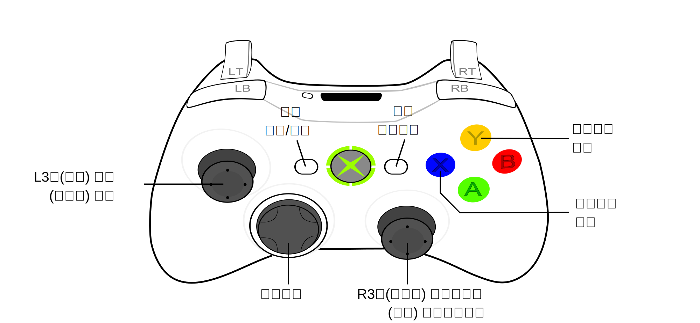

# UEVR通用自由攝影機插件
這插件的目標是讓大家在"任何"UEVR支援的遊戲中都能夠自由的移動，而不受遊戲本身的限制。
你想貼近角色觀看他的細節，或是想要飛到遠處看看遊戲的風景，這插件都能幫助你達成。
* 註：雖說是"任何"，但我還沒測試大量的遊戲。如果你使用上遇到什麼問題，請回報給我。
---
## 示範
讓我們先看看這插件的效果
<iframe width="560" height="315" src="https://www.youtube.com/embed/A5wXk5k4WVk?si=QvVLHk8kNeFYw6f2" title="YouTube video player" frameborder="0" allow="accelerometer; autoplay; clipboard-write; encrypted-media; gyroscope; picture-in-picture; web-share" referrerpolicy="strict-origin-when-cross-origin" allowfullscreen></iframe>

## 功能
* 自由攝影機：前後左右上下移動，2軸旋轉。 (手把熱鍵切換)
* 十段速度控制，適合各類型遊戲。
* 自定義熱鍵，避免與遊戲按鍵衝突。
* 兩種飛行模式：水平/全方位。 (預設為水平模式)
* 兩種操作設定：TPS/3D (目前僅支援TPS)

## 定製功能
除了通用功能外，本插件也可被其它插件調用進行定製，實現各別遊戲的額外功能。
* 環繞攝影機：遊戲進行中同時操作，環繞目標物體，並可即時拉遠拉近。
* 速度設定：為各別遊戲設定更適合於遊戲場景尺度的速度範圍。
* 場景距離設定：根據遊戲中不同的場景，調整最適合的攝影機推進距離。
* 事件系統：提供關卡切換、角色切換等事件。
* 控制器狀態：提供更容易使用的控制器狀態。
這個插件是開源的，您可以在自己的專案中自由使用。

## 預設操作方式
### 自由攝影機熱鍵
啟動/關閉自由攝影機模式：按住L3


### 自由攝影機操作


### 環繞攝影機操作
環繞攝影機又稱為關卡攝影機，是一種可在遊戲進行中同時操作的攝影機模式。
因為他使用到的按鈕數相當的少，當遊戲有額外按鍵可使用時，就可以使用定製遊戲的方式來打開這個功能。


## 自定義按鍵鍵
用文字編輯器打開插件主程式，比如通用版插件的檔名會是ds-uevr-universal-freecam.lua。
會看到類似這樣的設定：
```lua
freecam.buttons = {
    active = "L3_held",   -- 啟動自由攝影機模式
    deactive = "L3",      -- 離開自由攝影機模式
    resetCam = "Back",    -- 重置攝影機
    speedIncrease = "RB", -- 加速
    speedDecrease = "LB", -- 減速
}
```
這些是可使用的按鈕代號:
```
A, B, X, Y 
LB, RB, LT, RT, L3, R3
DPadUp, DPadDown, DPadLeft, DPadRight
Back, Start
```
- 若要指定按鈕組合，請使用 `+` 符號。例如：`Select+Y`
- 若要特別指定按鈕`按下、按住、放開、雙擊`等事件，請使用`pressed, held, released, doubleclick`，並以 `_` 符號分隔。例如：`L3_held`, `Select_pressed`
若未特別指定事件，單鍵的預設事件為 "released"，可符合大部份需求。而組合鍵不需要幫他指定事件。


# 安裝
1. [下載插件] (url)
2. 解壓縮到UEVR的script目錄

# 特別感謝
@praydog UEVR除了本身強大的功能外，還有提供了插件的支援，才有可能做出各遊戲通用的自由攝影機插件。
@mark-mon 公開的插件原始碼很有參考價值，並且非常熱心，在UEVR的DC提供了許多有用的資訊。
