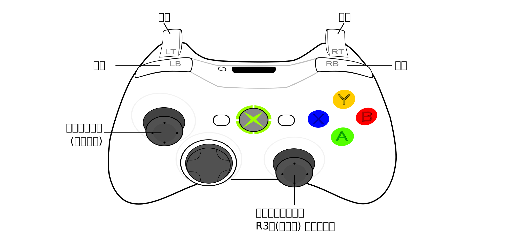
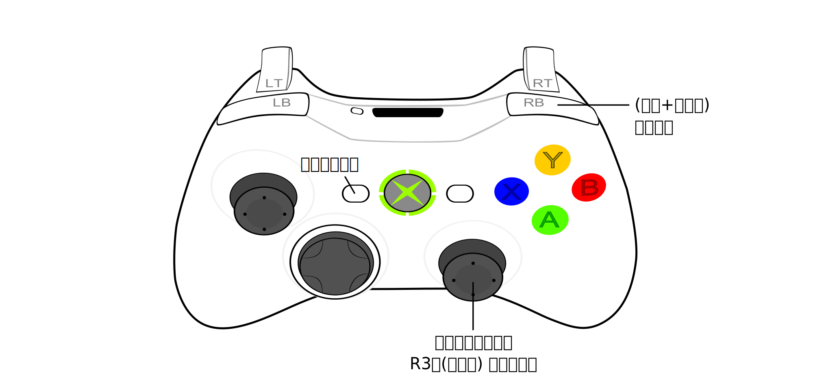

# UEVR通用自由攝影機插件

這插件的目標是讓大家在"任何"UEVR支援的遊戲中都能夠自由的移動，而不受遊戲本身的限制。  
比如想貼近角色觀看他的細節，或是想要飛到遠處欣賞遊戲的風景，這插件都能幫助你達成。


---
# 示範影片
<a href="https://www.youtube.com/watch?v=A5wXk5k4WVk" target="_blank">
    
</a>

# 主要功能
* **自由攝影機**：前後左右上下移動，2軸旋轉。 (控制器熱鍵切換)
* **三種飛行模式**：TPS水平/TPS全向/Space全向。 (預設為TPS水平模式)
* **三種跟隨模式**：跟隨/鎖定/只跟隨位置。 (預設為跟隨模式)
* **十段速度控制**：可適應各類型遊戲。
* **視野儲存/切換**：隨時儲存/切換視野。
* **環繞攝影機**：支援客製化插件使用。
* **自定義熱鍵**：避免與遊戲按鍵衝突。
* **自定義選項**：依照需求調整插件設定。

# 自由攝影機

* L3：(按住)啟用自由攝影機模式 / (按一下)關閉自由攝影機模式
* R3：(按一下)重置攝影機 / (按住)重置所有設定。
* X鍵：3種飛行模式切換。
* Y鍵：3種跟隨模式切換。
* Back鍵：視野儲存/切換。
* Start鍵：遊戲選單自動隱藏。
  
小秘訣：即使戴著VR也能正確操作。  
只要記得，任何時候你按住L3就是自由攝影機模式，只按一下就是回到一般模式。

# 飛行模式 (X鍵)
手把的X鍵可以切換三種飛行模式，分別是：
- TPS飛行模式-水平：按一下X鍵切換 (預設)
- TPS飛行模式-全向：按一下X鍵切換
- Space飛行模式-全向：按住X鍵

## TPS水平/全向飛行模式
操作方式大致和TPS遊戲角色的控制相同"，只多了`上下`移動的操作，這種控制方式簡單易懂，最適合大部份人使用。

- 水平模式：最容易操作的模式，攝影機往上下看時，不會造成高度的升降。  
適合在高空飛行看地面的景物，或是環繞角色觀看他的細節，不用擔心高度的變化。  

  
- 全向模式：攝影機的高度會隨著前進方向而改變。  
類似飛機的飛行習慣，或是用在像是攝影機正對角色，往後拉遠的情況。  


## Space全向飛行模式
左搖桿改為`上下左右`移動，最適合立體空間的複雜機動操作。  
而原本`前後`移動則改到RT/LT。  
這種控制方式只支援全向飛行，不會有水平飛行模式的選項。  
(附圖-示範)  
(附圖-操作設定)

# 跟隨模式 (Y鍵)
手把的Y鍵可以切換三種跟隨模式，分別是：
- 跟隨模式：按一下Y鍵 (預設)  
適合大部份的遊戲，攝影機會跟隨角色移動/旋轉。  
(附圖)  
- 鎖定模式：按住Y鍵  
當你想要固定攝影機的位置，不受角色移動的影響時，就可以使用這個模式。  
特別是在觀看過場動畫時，通常遊戲鏡頭會不斷的切換，你想用旁觀者的角度來看的話，就可以切換到這個模式。  
(附圖)  
小提醒：這模式因為全鎖定的關係，容易誤以為遊戲攝影機的操作失效！為了防止誤觸，特別設計成要按住Y鍵才會切換，而不是像飛行模式那樣按一下就切換。  
- 只跟隨位置：按兩下Y鍵  
這模式通常適合用於戴具中的情況。  
如果你不喜歡鏡頭被轉來轉去，想要把視野固定下來，但因為載具是會移動的，如果直接用鎖定模式，載具就自己跑走了....  
這時候就可使用這模式來解決問題。  
(附圖)  


# 視野儲存/切換 (Back鍵)
預設支援2個視野的儲存及切換。所謂視野，就是你目前的攝影機位置及角度。  
按住手把的Back鍵(Select鍵)可儲存目前的視野，只按一下Back鍵則切換到下一個視野。  
(附圖)  
這在你想要快速切換到不同的視野時，非常的方便。  

# 重置攝影機
按一下R3鍵可重置攝影機，讓攝影機回到原本位置。  
如果你有儲存視野，則攝影機會回到儲存的視野位置。  
這功能搭配視野儲存特別的好用，因為只要按一下隨時都能回到原位，大可安心的用自由攝影機處亂跑，  

# 重置所有設定
這是一個緊急救命鍵。  
任何時候！按住R3鍵會重置所有設定，包含攝影機、儲存的視野、以及跟隨模式。  
當你已經搞不清楚自己到底在幹麻，用力按住就對了，他會幫你把一切都回到最初的狀態。  
這功能還有另一個作用，就是幫助你回到原始的遊戲攝影機位置，重新開始設定儲存的視野。  

# 遊戲選單自動隱藏 (Start鍵)
有時你必需暫停遊戲來使用自由攝影機，這時候就會覺得遊戲選單擋在前面很煩人，就可以按一下Start鍵來自動隱藏遊戲選單。  
當你離開自由攝影機模式時，遊戲選單又會自動顯示。  
這功能預設為關閉，也就是你進自由攝影機之後，一定得按一次Start鍵才會生效。  
(以免不知道這功能的人以為遊戲選單壞了)  


# 自定義按鍵
這功能可以避免和遊戲按鍵衝突，或是你想要用自己習慣的按鍵操作。  
用文字編輯器打開插件主程式，比如通用版插件的檔名會是ds-uevr-universal-freecam.lua。  
會看到類似這樣的設定, 裏面有各項功能名稱：  
```lua
cfg.buttons = {
}
cfg.buttons = {
    active = "L3_held",   -- 啟動自由攝影機模式
    deactive = "L3",      -- 離開自由攝影機模式
    resetCam = "R3",      -- 重置攝影機
    resetAll = "R3_held", -- 完全重置，包含攝影機、儲存的視野、以及跟隨模式
    speedIncrease = "RB", -- 加速
    speedDecrease = "LB", -- 減速
    levelFlight = "X", -- 切換TPS水平/全向飛行模式
    omniFlightWithSpaceControl = "X_held", -- 啟用Space全向飛行模式
    followOn = "Y", -- 啟用跟隨模式
    followPositionOnly = "Y_doubleclick", -- 啟用只跟隨位置模式
    followOff = "Y_held", -- 啟用鎖定模式
    viewCycle = "Back", -- 視野切換
    viewSave = "Back_held", -- 儲存目前視野
    autoGameMenuToggle = "Start", -- 自動隱藏選單功能切換
}
```
要自訂義按鈕，可使用這些按鈕代號:  
```
A, B, X, Y 
LB, RB, LT, RT, L3, R3
DPadUp, DPadDown, DPadLeft, DPadRight
Back, Start
```
- 若要指定按鈕組合，請使用 `+` 符號。例如：`Select+Y`
- 若要另行指定按鈕`按下、按住、放開、雙擊`等事件，請使用`pressed, held, released, doubleclick`這幾個字，並以 `_` 符號和按鈕名稱分隔。例如：`L3_held`, `Select_pressed`  
若未特別指定事件，單鍵的預設事件為 "released"，可符合大部份需求。而按鈕組合不需要幫他指定事件。

# 自定義插件設定
```lua
cfg.opt={
    uevrAttachCameraCompatible = false, -- UEVR attached camera的相容模式，這會改變UEVR裏攝影機的數值，所以有需要的話再打開。
    autoGameMenuToggle = false, -- 進入自由攝影機模式時，是否預設自動隱藏遊戲的GUI。
    freecamInvertPitch = false, -- 反轉攝影機的俯仰操作。
    levelFlight = true, -- 預設使用水平飛行模式。
    recenterVROnCameraReset = true, -- 重置攝影機時，同時重置VR的中心。
}
```


# 環繞攝影機 (客製化插件)
環繞攝影機是一種在遊戲進行中可同時操作的攝影機模式。  
他使用到的按鈕數較少，操作也較簡單，所以當遊戲未使用右搖桿時，就可客製化插件實現這功能。  
例如在R-Type Final 2中，環繞攝影機的預設操作是像這樣：  

小提醒：這功能需要客製化遊戲插件的支援，通用版插件並不支援這功能。


# 客製化插件 (進階功能)
除了通用功能外，本插件也可被整合到其它插件進行客製，實現各別遊戲的額外功能。
* **環繞攝影機**：遊戲進行中同時操作，環繞目標物體，並可即時拉遠拉近。
* **場景攝影機**：根據遊戲中不同的場景，自定義攝影機的位置/速度/按鈕功能等等。
* **事件系統**：提供關卡切換、角色切換等事件。
* **控制器狀態**：提供更容易使用的控制器狀態判斷。
  
目前整合了Free Camera製作的客製遊戲插件有：
* [R-Type Final 2](https://github.com/dabinn/R-Type-Final-2-UEVR)

給開發者：這個插件是開源的，歡迎自由使用到你的插件中。  
我還沒寫開發文件，但你可以參考R-Type Final 2的插件原始碼，或是直接問我。

# 下載及安裝
1. [下載插件](https://github.com/dabinn/UEVR-Universal-Free-Camera/releases/)，並解壓縮  
1. 打開UEVR介面，按下`Open Golbal Dir`  
    
1.找到自己的遊戲名稱，裏面有個`scripts`目錄  

1. 把解壓縮後的檔案複製到`scripts`目錄  

1. 這樣就好啦
# 已知問題/注意事項
* 遊戲關卡切換後，手動儲存的攝影機位置可能會被重置。


# 特別感謝
[praydog](https://github.com/praydog)  
UEVR的作者，UEVR除了本身強大的功能外，還提供了優秀的插件支援，才有機會做出能讓各VR遊戲通用的自由攝影機插件。  

[mark-mon](https://github.com/mark-mon)  
他公開的UEVR插件原始碼很有參考價值，並且非常熱心，在UEVR的DC提供了許多有用的資訊。  
